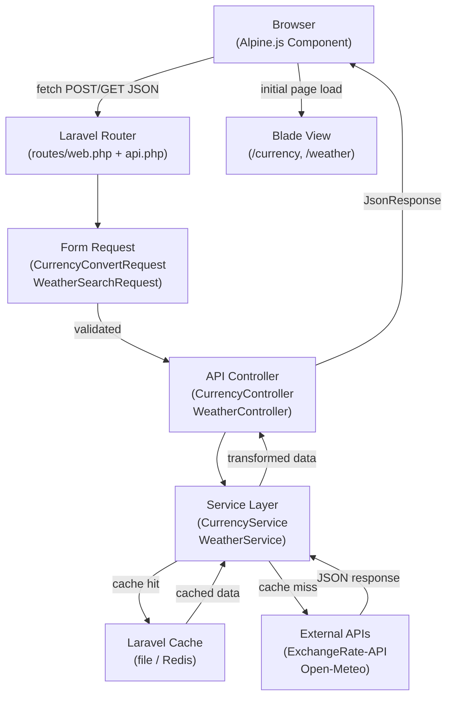

# Design Document

## Feature: laravel-api-wrapper

---

## Overview

This document describes the technical design for a portfolio-quality Laravel application that integrates two live public APIs — a **Currency Converter** and a **Weather Dashboard** — and exposes them through a clean, reactive frontend built with Alpine.js.

The application demonstrates professional Laravel development practices: service-layer architecture, Http Client usage, caching, Form Request validation, structured error handling, and environment-driven configuration. No build step is required for the frontend; Alpine.js is loaded from a CDN.

**Key design goals:**
- Thin controllers, fat services — all external API logic lives in dedicated service classes.
- Caching at the service layer to minimise external API calls.
- Consistent JSON error contract across all API endpoints.
- Alpine.js components that are self-contained and communicate exclusively with the internal JSON API.

---

## Architecture

The application follows a standard Laravel MVC structure with an added service layer. The request lifecycle is:

```
Browser (Alpine.js)
    │  fetch (JSON)
    ▼
Route (routes/web.php + routes/api.php)
    │
    ▼
Form Request (validation)
    │  passes
    ▼
API Controller
    │  calls
    ▼
Service Class (CurrencyService | WeatherService)
    │  checks
    ▼
Laravel Cache
    │  miss → Http::get(external API)
    │  hit  → return cached data
    ▼
JSON Response (success | error)
    │
    ▼
Alpine.js Component (renders result or error)
```



### External APIs

| API | Purpose | Base URL | Auth |
|-----|---------|----------|------|
| [ExchangeRate-API](https://www.exchangerate-api.com/docs/free) | Currency exchange rates | `https://v6.exchangerate-api.com/v6/{key}/latest/{base}` | Free API key (env var) |
| [Open-Meteo Geocoding](https://open-meteo.com/en/docs/geocoding-api) | City → coordinates | `https://geocoding-api.open-meteo.com/v1/search` | None |
| [Open-Meteo Weather](https://open-meteo.com/en/docs) | Current weather by coordinates | `https://api.open-meteo.com/v1/forecast` | None |

**Rationale for API choices:**
- **ExchangeRate-API free tier** provides a stable, well-documented endpoint returning all rates for a base currency in a single call — ideal for caching. A free API key is required (sign-up, no credit card).
- **Open-Meteo** requires no API key at all, making it zero-friction for portfolio setup. The two-step geocoding + weather fetch is a realistic pattern that demonstrates chained API calls.

---

## Components and Interfaces

### Routes

```
// Blade page routes (web.php)
GET  /currency          → CurrencyController@index
GET  /weather           → WeatherController@index

// JSON API routes (api.php)
POST /api/currency/convert  → CurrencyController@convert
GET  /api/weather/search    → WeatherController@search
```

### Form Requests

**`App\Http\Requests\CurrencyConvertRequest`**
```php
rules(): [
    'amount'   => ['required', 'numeric', 'gt:0'],
    'from'     => ['required', 'string', 'size:3', 'regex:/^[A-Z]{3}$/'],
    'to'       => ['required', 'string', 'size:3', 'regex:/^[A-Z]{3}$/'],
]
```

**`App\Http\Requests\WeatherSearchRequest`**
```php
rules(): [
    'city' => ['required', 'string', 'max:100'],
]
```

Both Form Requests override `failedValidation()` to return a JSON 422 response (since the endpoints are consumed via `fetch`, not a traditional form POST).

### Controllers

**`App\Http\Controllers\CurrencyController`**
- `index()` — returns the Blade view for `/currency`
- `convert(CurrencyConvertRequest $request)` — delegates to `CurrencyService`, returns `JsonResponse`

**`App\Http\Controllers\WeatherController`**
- `index()` — returns the Blade view for `/weather`
- `search(WeatherSearchRequest $request)` — delegates to `WeatherService`, returns `JsonResponse`

Controllers catch `ApiException`, `RateLimitException`, and `CityNotFoundException` and map them to appropriate HTTP status codes.

### Service Classes

**`App\Services\CurrencyService`**

| Method | Signature | Description |
|--------|-----------|-------------|
| `convert` | `convert(float $amount, string $from, string $to): array` | Returns `['converted_amount', 'rate', 'from', 'to']` |
| `getRates` | `getRates(string $base): array` | Fetches/caches rates for a base currency |
| `fetchFromApi` | `fetchFromApi(string $base): array` | Makes Http Client call to ExchangeRate-API |

**`App\Services\WeatherService`**

| Method | Signature | Description |
|--------|-----------|-------------|
| `getWeather` | `getWeather(string $city): array` | Returns normalised weather data |
| `geocode` | `geocode(string $city): array` | Resolves city name to `['lat', 'lon', 'display_name']` |
| `fetchWeather` | `fetchWeather(float $lat, float $lon): array` | Fetches current weather from Open-Meteo |

### Custom Exceptions

```
App\Exceptions\
├── ApiException.php          // Wraps 4xx/5xx from external APIs → HTTP 502
├── RateLimitException.php    // Wraps HTTP 429 from external APIs → HTTP 429
└── CityNotFoundException.php // City geocoding returned no results → HTTP 404
```

### Alpine.js Components

Both components follow the same pattern:

```javascript
// Inline x-data object (defined in Blade view)
{
    // form fields
    loading: false,
    result: null,
    error: null,

    async submit() {
        this.loading = true;
        this.result = null;
        this.error = null;
        try {
            const res = await fetch('/api/...', { method: 'POST', ... });
            const data = await res.json();
            if (!res.ok) { this.error = data.message; return; }
            this.result = data;
        } catch (e) {
            this.error = 'Network error. Please try again.';
        } finally {
            this.loading = false;
        }
    }
}
```

---

## Data Models

There are no database tables in this application. All data is transient (fetched from external APIs and optionally cached). The data shapes below describe the in-memory structures passed between layers.

### Currency Conversion Request (inbound)

```json
{
  "amount": 100.00,
  "from": "USD",
  "to": "EUR"
}
```

### Currency Conversion Response (success)

```json
{
  "success": true,
  "from": "USD",
  "to": "EUR",
  "amount": 100.00,
  "converted_amount": 92.15,
  "rate": 0.9215
}
```

### Currency Conversion Response (error)

```json
{
  "success": false,
  "message": "Exchange rate service is currently unavailable.",
  "code": "API_ERROR"
}
```

### Weather Search Request (inbound)

```
GET /api/weather/search?city=London
```

### Weather Search Response (success)

```json
{
  "success": true,
  "city": "London",
  "country": "GB",
  "temperature_c": 14.2,
  "temperature_f": 57.6,
  "condition": "Partly cloudy",
  "humidity": 72,
  "wind_speed_kmh": 18.5
}
```

### Weather Search Response (error — city not found)

```json
{
  "success": false,
  "message": "City 'Xyzabc' could not be found.",
  "code": "CITY_NOT_FOUND"
}
```

### Validation Error Response (422)

```json
{
  "success": false,
  "message": "The given data was invalid.",
  "errors": {
    "amount": ["The amount must be greater than 0."],
    "from": ["The from field must be 3 uppercase letters."]
  }
}
```

### Cache Keys

| Key Pattern | TTL | Content |
|-------------|-----|---------|
| `currency.rates.{BASE}` | 60 min | Full rates array for base currency |
| `weather.{normalised_city}` | 10 min | Normalised weather response array |

City name normalisation: `strtolower(trim($city))` — e.g., `"  London "` → `"london"`.

### WMO Weather Code Mapping

Open-Meteo returns a numeric `weather_code` (WMO standard). The `WeatherService` maps this to a human-readable condition string using a lookup table:

```php
// Partial example
private const WMO_CODES = [
    0  => 'Clear sky',
    1  => 'Mainly clear',
    2  => 'Partly cloudy',
    3  => 'Overcast',
    45 => 'Foggy',
    61 => 'Light rain',
    71 => 'Light snow',
    95 => 'Thunderstorm',
    // ...
];
```

### Environment Variables

```dotenv
# ExchangeRate-API
EXCHANGE_RATE_API_KEY=your_api_key_here
EXCHANGE_RATE_API_BASE_URL=https://v6.exchangerate-api.com/v6

# Open-Meteo (no key required)
OPEN_METEO_GEOCODING_URL=https://geocoding-api.open-meteo.com/v1/search
OPEN_METEO_WEATHER_URL=https://api.open-meteo.com/v1/forecast

# Cache driver (file works out of the box; redis for production)
CACHE_DRIVER=file
```

All URLs and keys are accessed via `config('services.exchange_rate.*')` and `config('services.open_meteo.*')`, defined in `config/services.php`.

---

## Correctness Properties

*A property is a characteristic or behavior that should hold true across all valid executions of a system — essentially, a formal statement about what the system should do. Properties serve as the bridge between human-readable specifications and machine-verifiable correctness guarantees.*

### Property 1: Currency conversion math is correct

*For any* positive numeric amount and any two currency codes present in a mocked exchange rates map, `CurrencyService::convert()` SHALL return a `converted_amount` equal to `amount × rate` and a `rate` equal to the value stored in the rates map for the target currency — within floating-point rounding tolerance.

**Validates: Requirements 1.2**

---

### Property 2: Cached exchange rates are served without external API calls

*For any* base currency code, if rates for that currency have already been fetched and stored in the cache, a subsequent call to `CurrencyService::getRates()` SHALL return the same data and SHALL NOT invoke the Http Client.

**Validates: Requirements 1.6, 1.7**

---

### Property 3: Weather response contains all required fields for any valid input

*For any* city name that resolves to coordinates, `WeatherService::getWeather()` SHALL return a response containing `temperature_c`, `temperature_f`, `condition` (non-empty string), `humidity`, and `wind_speed_kmh` — regardless of the specific WMO weather code or numeric values returned by the mocked API.

**Validates: Requirements 2.2, 5.5**

---

### Property 4: Cached weather data is served without external API calls

*For any* city name (including variations in letter case and surrounding whitespace), if weather data for the normalised form of that city name is already cached, a subsequent call to `WeatherService::getWeather()` SHALL return the cached data and SHALL NOT invoke the Http Client.

**Validates: Requirements 2.6, 2.7**

---

### Property 5: Invalid currency conversion inputs are rejected before any external call

*For any* currency conversion request where the amount is not a positive number (e.g., zero, negative, non-numeric) or either currency code is not a 3-letter uppercase alphabetic string, the controller SHALL return HTTP 422 with an `errors` object listing the invalid fields, and SHALL NOT invoke the Http Client.

**Validates: Requirements 3.1, 3.3, 3.4**

---

### Property 6: Invalid weather search inputs are rejected before any external call

*For any* weather search request where the city name is an empty string or a string exceeding 100 characters, the controller SHALL return HTTP 422 with an `errors` object, and SHALL NOT invoke the Http Client.

**Validates: Requirements 3.2, 3.3, 3.4**

---

### Property 7: Celsius-to-Fahrenheit conversion is mathematically consistent

*For any* temperature value in Celsius returned by the Open-Meteo API, the `temperature_f` value in the `WeatherService` response SHALL equal `(celsius × 9 / 5) + 32`, within a tolerance of 0.01°F.

**Validates: Requirements 5.5**

---

## Error Handling

### Error Response Contract

All JSON error responses follow a consistent shape:

```json
{
  "success": false,
  "message": "Human-readable description",
  "code": "MACHINE_READABLE_CODE"
}
```

### HTTP Status Code Mapping

| Scenario | Exception | HTTP Status |
|----------|-----------|-------------|
| Validation failure | `ValidationException` (Form Request) | 422 |
| External API 4xx/5xx | `ApiException` | 502 |
| External API rate limit (429) | `RateLimitException` | 429 |
| City not found | `CityNotFoundException` | 404 |
| Unexpected server error | `\Throwable` | 500 |

### Exception Handling in Controllers

Controllers use a try/catch block that maps each exception type to its HTTP status:

```php
try {
    $result = $this->service->convert(...);
    return response()->json(['success' => true, ...$result]);
} catch (RateLimitException $e) {
    Log::warning('Rate limit hit', ['service' => 'currency', 'at' => now()]);
    return response()->json(['success' => false, 'message' => 'Too many requests. Please try again later.', 'code' => 'RATE_LIMITED'], 429);
} catch (ApiException $e) {
    return response()->json(['success' => false, 'message' => 'External service unavailable.', 'code' => 'API_ERROR'], 502);
} catch (\Throwable $e) {
    Log::error('Unexpected error', ['exception' => $e->getMessage()]);
    return response()->json(['success' => false, 'message' => 'An unexpected error occurred.', 'code' => 'SERVER_ERROR'], 500);
}
```

### Service-Layer Error Detection

`CurrencyService` and `WeatherService` inspect the Http Client response:

```php
$response = Http::timeout(10)->get($url, $params);

if ($response->status() === 429) {
    throw new RateLimitException('Rate limit exceeded for ' . $serviceName);
}

if ($response->failed()) {
    throw new ApiException('External API returned ' . $response->status());
}
```

`->throw()` is **not** used directly; instead, status codes are checked explicitly so that 429 can be distinguished from other 4xx/5xx errors.

### Logging

All `RateLimitException` instances are logged at `warning` level via `Log::warning()` with the service name and timestamp. Unexpected `\Throwable` instances are logged at `error` level.

---

## Testing Strategy

### Overview

The testing strategy uses a dual approach:
- **Unit / feature tests** (PHPUnit, Laravel's built-in test suite) for specific examples, edge cases, and controller behaviour.
- **Property-based tests** (using [**Eris**](https://github.com/giorgiosironi/eris) — a PHP property-based testing library) for universal properties that should hold across a wide range of inputs.

### Unit and Feature Tests

**Service layer (unit tests with Http::fake())**
- `CurrencyService` returns correct converted amount for known rates.
- `CurrencyService` throws `ApiException` when Http Client returns 5xx.
- `CurrencyService` throws `RateLimitException` when Http Client returns 429.
- `WeatherService` throws `CityNotFoundException` when geocoding returns empty results.
- `WeatherService` maps WMO code 0 → "Clear sky", code 95 → "Thunderstorm", etc.
- Cache is populated after a successful fetch (assert `Cache::has()`).
- Cache is read on second call (assert Http::fake() was called only once).

**Controller / HTTP tests (Laravel feature tests)**
- `POST /api/currency/convert` with valid data returns 200 with correct shape.
- `POST /api/currency/convert` with invalid amount returns 422 with `errors` key.
- `POST /api/currency/convert` when service throws `ApiException` returns 502.
- `POST /api/currency/convert` when service throws `RateLimitException` returns 429.
- `GET /api/weather/search?city=London` returns 200 with required fields.
- `GET /api/weather/search` with empty city returns 422.
- `GET /api/weather/search?city=Xyzabc` when geocoding returns empty returns 404.
- `GET /currency` returns 200 (Blade view renders).
- `GET /weather` returns 200 (Blade view renders).

### Property-Based Tests

Property-based tests use [Eris](https://github.com/giorgiosironi/eris) and are configured to run a minimum of **100 iterations** per property. Each test is tagged with a comment referencing the design property.

**Tag format:** `// Feature: laravel-api-wrapper, Property {N}: {property_text}`

| Property | Test Description | Generator |
|----------|-----------------|-----------|
| Property 1 | For any positive float amount and any two currency codes in a mocked rates map, `convert()` returns `amount × rate` | `float()` (positive), `elements()` from currency list |
| Property 2 | For any base currency, calling `getRates()` twice invokes Http::fake() only once | `elements()` from currency list |
| Property 3 | For any mocked WMO code and numeric weather values, `getWeather()` response contains all required fields | `elements()` from WMO codes, `float()` for temp/humidity/wind |
| Property 4 | For any city string (varying case/whitespace), if normalised key is cached, second call makes no Http request | `string()` (non-empty, ≤100 chars, random casing) |
| Property 5 | For any invalid currency request (bad amount or bad code), controller returns 422 and Http::assertNothingSent() | `float()` (non-positive), `string()` (invalid codes) |
| Property 6 | For any city string that is empty or >100 chars, controller returns 422 and Http::assertNothingSent() | `string()` (length > 100), constant `""` |
| Property 7 | For any Celsius float, `temperature_f` in response equals `(c × 9/5) + 32` within 0.01 tolerance | `float()` (bounded range -100 to 100) |

### Test File Structure

```
tests/
├── Unit/
│   ├── Services/
│   │   ├── CurrencyServiceTest.php
│   │   └── WeatherServiceTest.php
│   └── Properties/
│       ├── CurrencyPropertyTest.php
│       └── WeatherPropertyTest.php
└── Feature/
    ├── CurrencyControllerTest.php
    └── WeatherControllerTest.php
```

### Running Tests

```bash
php artisan test
# or
./vendor/bin/phpunit
```
